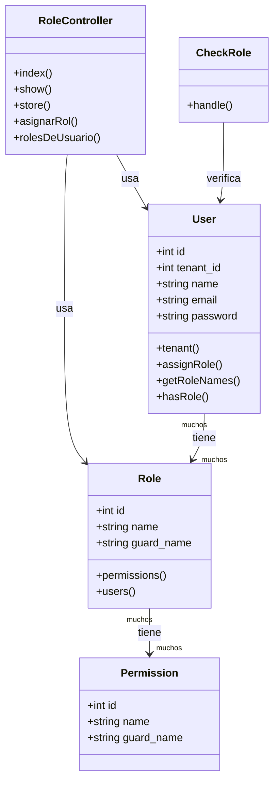
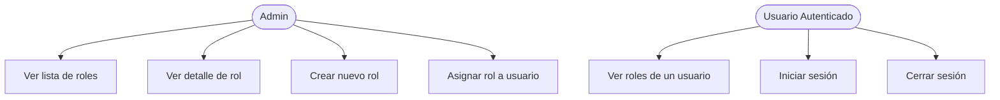
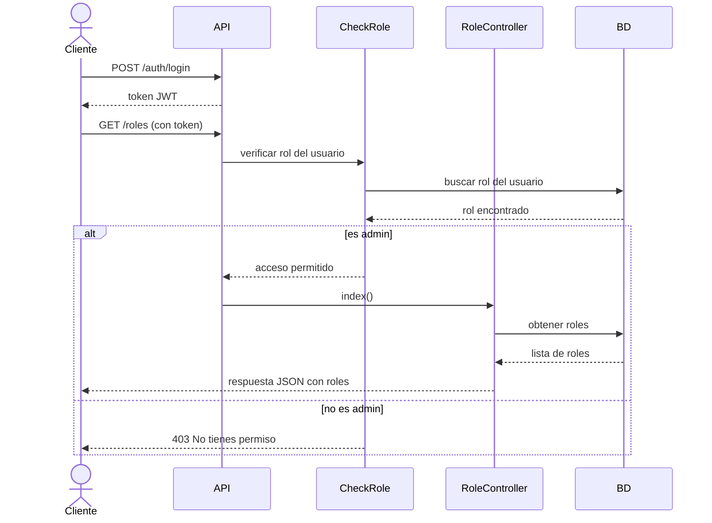

# Diagramas UML - Módulo 26: Roles y Permisos

## Diagrama de Clases

```mermaid
classDiagram
    class User {
        +int id
        +int tenant_id
        +string name
        +string email
        +string password
        +tenant()
        +assignRole()
        +getRoleNames()
        +hasRole()
    }

    class Role {
        +int id
        +string name
        +string guard_name
        +permissions()
        +users()
    }

    class Permission {
        +int id
        +string name
        +string guard_name
    }

    class RoleController {
        +index()
        +show()
        +store()
        +asignarRol()
        +rolesDeUsuario()
    }

    class CheckRole {
        +handle()
    }

    User "muchos" --> "muchos" Role : tiene
    Role "muchos" --> "muchos" Permission : tiene
    RoleController --> Role : usa
    RoleController --> User : usa
    CheckRole --> User : verifica
```

## Diagrama de Caso de Uso

```mermaid
flowchart TD
    Admin([Admin])
    User([Usuario Autenticado])

    Admin --> A[Ver lista de roles]
    Admin --> B[Ver detalle de rol]
    Admin --> C[Crear nuevo rol]
    Admin --> D[Asignar rol a usuario]
    User --> E[Ver roles de un usuario]
    User --> F[Iniciar sesión]
    User --> G[Cerrar sesión]
```

## Diagrama de Secuencia

```mermaid
sequenceDiagram
    actor Cliente
    participant API
    participant CheckRole
    participant RoleController
    participant BD

    Cliente->>API: POST /auth/login
    API-->>Cliente: token JWT

    Cliente->>API: GET /roles (con token)
    API->>CheckRole: verificar rol del usuario
    CheckRole->>BD: buscar rol del usuario
    BD-->>CheckRole: rol encontrado

    alt es admin
        CheckRole-->>API: acceso permitido
        API->>RoleController: index()
        RoleController->>BD: obtener roles
        BD-->>RoleController: lista de roles
        RoleController-->>Cliente: respuesta JSON con roles
    else no es admin
        CheckRole-->>Cliente: 403 No tienes permiso
    end
```
